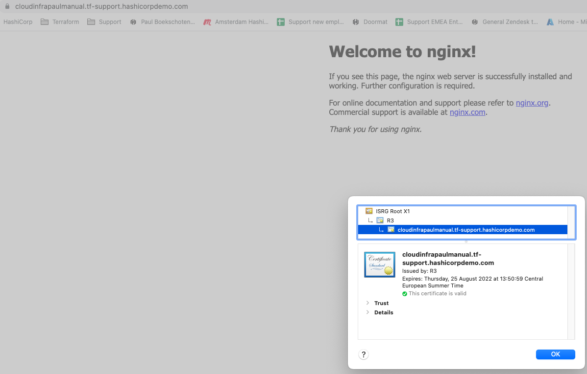

# Nginx with valid cert on AWS
This repository installs an Nginx with a valid certificate on AWS.  

This terraform code creates:
- A DNS entry in Route53
- A valid certificate with LetsEncrypt
- A security group with inbound rules for port 22, 80, 443 and ICMP
- An Ubuntu virtual machine with Nginx

# Usage
Git clone
```
git clone https://github.com/paulboekschoten/aws_nginx_valid_cert.git
```

Change directory
```
cd aws_nginx_valid_cert
```

# Check variables
Copy the file `terraform.tfvars_example` to `terraform.tfvars`.  

Set your values for cert_email, route53_zone and route53_subdomain.
```
cert_email        = "youruser@yourdomain.com"
route53_zone      = "subdomain.yourdomain.com"
route53_subdomain = "nginxvalid-cert"
```  
  

# Terraform init
```
terraform init
```
Sample output
```
Initializing the backend...

Initializing provider plugins...
- Finding latest version of hashicorp/null...
- Finding vancluever/acme versions matching "2.8.0"...
- Finding latest version of hashicorp/aws...
- Finding latest version of hashicorp/tls...
- Using hashicorp/null v3.1.1 from the shared cache directory
- Using vancluever/acme v2.8.0 from the shared cache directory
- Using hashicorp/aws v4.19.0 from the shared cache directory
- Using hashicorp/tls v3.4.0 from the shared cache directory

Terraform has created a lock file .terraform.lock.hcl to record the provider
selections it made above. Include this file in your version control repository
so that Terraform can guarantee to make the same selections by default when
you run "terraform init" in the future.

Terraform has been successfully initialized!

...
```
  

# Terraform apply
```
terraform apply
```
Sample output
```
...

Plan: 14 to add, 0 to change, 0 to destroy.

Changes to Outputs:
  + dns = (known after apply)

Do you want to perform these actions?
  Terraform will perform the actions described above.
  Only 'yes' will be accepted to approve.

  Enter a value: 
```
Answer with `yes` if your want to proceed.  

```
...

null_resource.config (remote-exec): No VM guests are running outdated
null_resource.config (remote-exec):  hypervisor (qemu) binaries on this
null_resource.config (remote-exec):  host.
null_resource.config: Creation complete after 20s [id=4126387254427133581]

Apply complete! Resources: 14 added, 0 changed, 0 destroyed.
```

# Output  
At the end you will also see an output  
```
Outputs:

dns = "<yoursubdomain>.<yourdomain>"
```
If you visit this link on http or https you should see this
  

With a valid certificate on https  
  

# TODO / DONE
- [x] Add lockfile to gitignore
- [x] Check and reorder variables
- [x] Check outputs
- [x] Supplement this readme
- [x] Check destroy/apply
